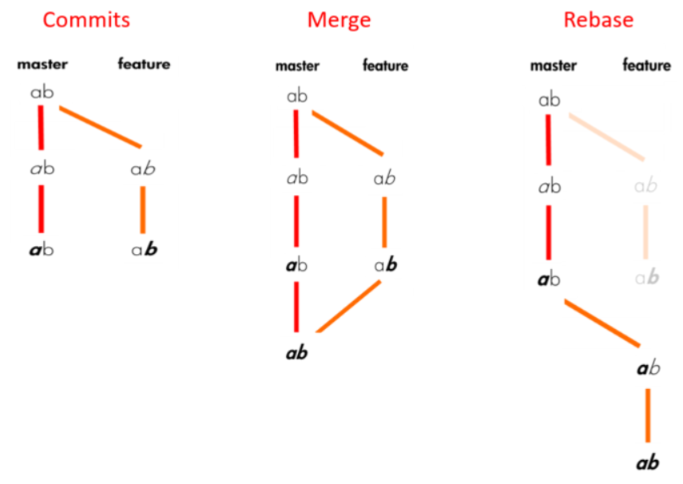

# Modelo colaborativo de Desarrollo

> En esta gúia se detalla paso a paso cómo configurar el ambiente de desarrollo local y el desarrollo de nuevos

## Configuración IDE

Se recomienda el uso de [**Visual Studio Code**](https://code.visualstudio.com/Download) y las siguientes extensiones:

- [Prettier - Code formatter](https://marketplace.visualstudio.com/items?itemName=esbenp.prettier-vscode)
- [Eslint](https://marketplace.visualstudio.com/items?itemName=dbaeumer.vscode-eslint)
- [vscode-styled-jsx](https://marketplace.visualstudio.com/items?itemName=blanu.vscode-styled-jsx)
- (Opcional) [Gitlens](https://marketplace.visualstudio.com/items?itemName=eamodio.gitlens)

Y la siguiente configuración:

- Activar **Editor: Format on save**

## Guía de nuevos desarrollos

### Proyecto Base

[Galicia SPA Starter](https://github.bancogalicia.com.ar/onba-commons/galicia-spa-starter-web) es un proyecto base con NextJS, `Galicia UI` y `Galicia Toolkit` para nuevos desarrollos de SPA que deben integrarse en canales.

### Modelo de Branches

> El desarrollo actual se encuentra en `master`. Todo nuevo desarrollo, corección o documentación se trabaja bajo la modalidad de `feature branch` y las releases candidatas a salir a producción se identifican mediante `tags`.


Con este modelo se busca asegurar la calidad de los desarrollos previo a su integración en `master` mediante: code reviews, unit testing, linting.

### 1. Actualizar `master`

Es importante tener actualizado master para que nuestra `feature branch` tome como base los últimos cambios.

```
git checkout master
git pull
```

### 2. Crear `feature branch`

> Una feature branch debe contener un conjunto de cambios relacionados. Ej: un nuevo componente, una nueva pantalla.
> Esto permite que estos cambios puedan ser integrados de manera independiente.

```
git checkout -b <scope>/<funcionalidad>
```

Se debe usar una nombre representativo de lo que se está trabajando y se deberá respetar la siguiente convención:

- **scope:** fix, feat, docs, refactor
- **funcionalidad:** en minúsculas y separado por guiones

Ej: feat/mi-nueva-funcionalidad, fix/correccion-componente, refactor/ajustes-componente

### 3. Commits

Para los mensajes de commits se toma como referencia [`conventional commits`](https://www.conventionalcommits.org/en/v1.0.0-beta.4/#summary).

```
<type>[optional scope]: <description>

[optional body]

[optional footer]
```

- **type:** chore, docs, feat, fix, refactor (más comunes)
- **scope:** indica la página, componente, funcionalidad
- **description:** comienza en minúsculas y no debe superar los 72 caracteres.

Ej: feat(input): nuevo componente de input, fix: corrige overview

> Como buena práctica se recomienda realizar commits frecuentes. Los mensajes de los commits del feature branch sólo le deben servir a quien lo desarrolle. Ya que una vez que se integren estos cambios en master, se unificarán en un sólo commit (con el nombre del branch) mediante `git squash`

#### ¿Qué no incluir / no borrar en el commit?

- `package.json` y `package-lock.json` (sólo cuando se incluyan nuevas dependencias)
- `.npmrc`

#### Testing

En `Galicia SPA Starter` hay un ejemplo de test unitario basado en [`jest`](https://jestjs.io) y [`react testing library`](https://testing-library.com/docs/react-testing-library/)

Para ejecutar los tests:

```
npm test
```

#### Linting

Se utiliza `eslint` para realizar análisis estático de código. Esto permite detectar

Para ejecutar el linting:

```
npm run lint
```

#### Chequeos durante commit

Se utilizan [`git hooks`](https://git-scm.com/book/en/v2/Customizing-Git-Git-Hooks) para realizar validaciones en el mensaje del commit y el código.
Para gestionar estos hooks se utiliza [`husky`](https://github.com/typicode/husky) y [`lint-staged`](https://github.com/okonet/lint-staged). Se valida:

- mensaje de commit [(commitlint)](https://www.conventionalcommits.org)
- formateo [(prettier)](https://prettier.io/)
- linting [(eslint)](https://eslint.org/)

### 4. Tomar últimos cambios de `master`

Frecuentemente o, al menos antes de generar un merge request, se debe actualizar el `feature branch` para incorporar los últimos cambios de master.

#### Rebase vs merge



**Ventajas del rebase**

- historial más limpio
- en el caso de conflictos, tengo aplicar código propio sobre los nuevos cambios

```
git fetch
git rebase origin/master
```

### 5. Push de cambios

```
git push -u origin feat/mi-nueva-feature
```

> Es importante utilizar el -u en el primer push para que quede asociado el tracking branch.

> Como buena práctica es recomendable hacer push de manera frecuente, aunque todavía no se genere el `merge request`

### 6. Creación de `Merge Request`

1. Abrir el proyecto en Gitlab y luego **New Merge Request**
2. Seleccionar el branch a integrar y luego comparar
   
3. Completar detalle del `merge request`
   
4. Submit **Merge Request**

> El `Merge Request` le permite al revisor proveer feedback y sugerencias de cambios. Una vez que se corrijan todos estos puntos pendientes, se procederá con la integración a master.
